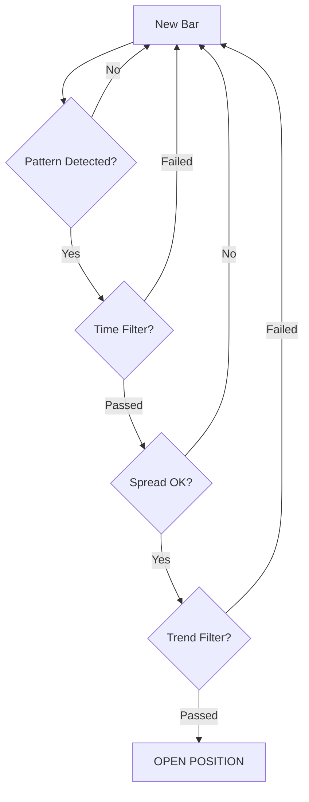

# 🏆 Gold Candle Trading Bot

[](https://www.python.org/downloads/)
[](https://www.backtrader.com/)
[](LICENSE)

Automated trading bot for Gold (XAUUSD) and Crypto (BTC/ETH) using a two-candle pattern strategy with adaptive sizing, grid recovery, and comprehensive risk management.

---

## 📋 Table of Contents

- [Features](#-features)
- [Strategy Overview](#-strategy-overview)
- [Quick Start](#-quick-start)
- [Installation](#-installation)
- [Strategy Configuration](#-strategy-configuration)
- [Optimizer Tool](#-optimizer-tool)
- [Project Structure](#-project-structure)
- [Performance Metrics](#-performance-metrics)
- [Best Practices](#-best-practices)
- [Troubleshooting](#-troubleshooting)
- [Roadmap](#-roadmap)

---

## ✨ Features

### 🎯 **Core Strategy**
- 📊 **Two-Candle Pattern Recognition** - Detects small setup candle followed by big trigger candle
- 🔄 **Adaptive Candle Sizing** - ATR-based OR percentile-based dynamic thresholds
- 📈 **Trend Filter** - EMA/SMA-based trend confirmation
- ⏰ **Time Filter** - Trade only during optimal hours (5 AM - 12 PM default)
- 💰 **Flexible TP/SL** - ATR-based (dynamic) or fixed points (static)

### 🛡️ **Risk Management**
- 🎯 **Position Stop Loss** - Static or trailing per-position stops
- 📉 **Equity Protection** - Hard drawdown limits and trailing equity stops
- 🔒 **Position Sizing** - Validates positions against account equity limits
- 📊 **Spread Filter** - Avoids trades during high-spread conditions

### 🔧 **Grid Trading** (Optional)
- 📐 **ATR-Based Spacing** - Dynamic grid level placement
- 📈 **Lot Multiplier** - Progressive position sizing for recovery
- 🎯 **Basket Management** - Shared TP/SL for grid positions
- 🚦 **Max Positions Limit** - Prevents over-exposure

### 🔬 **Optimization Tools**
- 📈 **Profitability Testing** - Find most profitable TP/SL ratios
- 🎲 **Candle Size Optimization** - Test hundreds of threshold combinations
- 📊 **Performance Metrics** - Win rate, profit factor, drawdown, Sharpe ratio
- 🕐 **Time Filter Testing** - Match your strategy's trading hours

---

## 🎯 Strategy Overview

### How It Works

```
┌─────────────────────────────────────────────────────────┐
│  Bar -2 (Setup)    Bar -1 (Trigger)    Bar 0 (Entry)   │
│                                                          │
│   🟢 Small          🟢🟢 Big            ⬆️ BUY          │
│   Candle            Candle                               │
│                                                          │
│   Setup: Range ≤ Small Threshold (20th percentile)     │
│   Trigger: Range ≥ Big Threshold (90th percentile)     │
│   Direction: Bullish setup + trend up = BUY            │
└─────────────────────────────────────────────────────────┘
```

### Adaptive Thresholds

**ATR Method** (Dynamic - Updates Every Bar)
```python
Small Candle = 0.8 × ATR(14)
Big Candle = 1.1 × ATR(14)
```

**Percentile Method** (Rolling Window - Updates Every 100 Bars)
```python
Small Candle = 20th percentile of last 200 candles
Big Candle = 90th percentile of last 200 candles
```

### Entry Logic



---

## 🚀 Quick Start

### 1️⃣ Run Strategy (Backtest)

```python
import backtrader as bt
from ken_gold_candle import GoldCandleKenStrategy, run_backtest

# Load your data
data = bt.feeds.GenericCSVData(
    dataname='xauusd_1min.csv',
    dtformat='%Y-%m-%d %H:%M:%S',
    timeframe=bt.TimeFrame.Minutes
)

# Run backtest
results = run_backtest(data)
```

### 2️⃣ Optimize Parameters

```bash
# Find most profitable TP/SL ratios
python strategy_optimizer.py \
  --api-key YOUR_POLYGON_API_KEY \
  --symbol XAUUSD \
  --asset-class forex \
  --start 2025-05-01 \
  --end 2025-09-30 \
  --start-hour 5 \
  --end-hour 12 \
  --optimize-tp-sl
```

### 3️⃣ Apply Results

Edit `ken_gold_candle.py`:
```python
# From optimizer output
USE_ATR_TP_SL = True
TP_ATR_MULTIPLIER = 3.0  # Best from optimization
SL_ATR_MULTIPLIER = 2.0  # Best from optimization
```

---

## 📦 Installation

### Prerequisites
- Python 3.8+
- Polygon.io API Key ([Get Free Key](https://polygon.io/))

### Install Dependencies

```bash
# For strategy only
pip install backtrader

# For optimizer (includes strategy dependencies)
pip install requests pandas numpy backtrader
```

### Get API Key

1. Sign up at [Polygon.io](https://polygon.io/)
2. Free tier: 5 API calls/min (sufficient for testing)
3. Basic plan: $29/month (recommended for extensive optimization)

---

## ⚙️ Strategy Configuration

### 🎛️ Core Settings

```python
# Account Configuration
LOT_SIZE = 0.01                    # Minimum position size
CONTRACT_SIZE = 100                # XAUUSD: 1 lot = 100 oz
MAX_POSITION_SIZE_PERCENT = 100.0  # Max % of equity per position

# Pattern Detection (Choose ONE)
USE_ATR_CALCULATION = True         # ✅ Dynamic (ATR-based)
USE_PERCENTILE_CALCULATION = False # ❌ Rolling window (percentile)

ATR_SMALL_MULTIPLIER = 0.8         # Small = 0.8x ATR
ATR_BIG_MULTIPLIER = 1.1           # Big = 1.1x ATR

# Take Profit / Stop Loss (Choose ONE)
USE_ATR_TP_SL = False              # ❌ Use fixed points
TP_ATR_MULTIPLIER = 3.0            # TP = 3.0x ATR (if enabled)
SL_ATR_MULTIPLIER = 2.0            # SL = 2.0x ATR (if enabled)

TAKE_PROFIT_POINTS = 150           # Fixed TP in points
POSITION_SL_POINTS = 50            # Fixed SL in points
```

### 🛡️ Risk Management

```python
# Position Stop Loss (Choose ONE)
ENABLE_POSITION_SL = False         # ❌ Static SL per position
ENABLE_TRAILING_POSITION_SL = True # ✅ Trailing SL (locks in profits)
TRAILING_POSITION_SL_POINTS = 50   # Trail distance

# Account Protection (Choose ONE)
ENABLE_EQUITY_STOP = False         # ❌ Hard drawdown limit
ENABLE_TRAILING_EQUITY_STOP = False # ❌ Trailing equity protection
MAX_DRAWDOWN_PERCENT = 1.0         # Max account drawdown %
```

### 🔧 Grid Trading (Optional)

```python
ENABLE_GRID = False                # ❌ Grid disabled by default
ATR_MULTIPLIER_STEP = 3.5          # Grid spacing (3.5x ATR)
LOT_MULTIPLIER = 1.05              # Position size multiplier
MAX_OPEN_TRADES = 2                # Limit grid depth
GRID_PROFIT_POINTS = 150           # Basket TP
```

### 🎯 Filters

```python
# Trend Filter
ENABLE_TREND_FILTER = True         # ✅ Use MA for trend
MA_PERIOD = 100
MA_METHOD = 1                      # 1=EMA, 0=SMA

# Time Filter
ENABLE_TIME_FILTER = True          # ✅ Trade 5 AM - 12 PM
START_HOUR = 5
END_HOUR = 12

# Spread Filter
MAX_SPREAD_POINTS = 20             # Reject high spread entries
```

---

## 🔬 Optimizer Tool

### Features

| Feature | Description |
|---------|-------------|
| 📊 **Signal Count Analysis** | Test percentile/ATR combinations for signal frequency |
| 💰 **TP/SL Optimization** | Find most profitable take profit and stop loss levels |
| 🎯 **Candle Size Testing** | Identify which thresholds generate highest profits |
| 📈 **Performance Metrics** | Win rate, profit factor, drawdown, Sharpe ratio |
| ⏰ **Time Filter Support** | Match your strategy's trading hours |

### Usage Examples

#### 🔍 Basic Analysis

```bash
python strategy_optimizer.py \
  --api-key YOUR_KEY \
  --symbol XAUUSD \
  --asset-class forex \
  --start 2025-09-01 \
  --end 2025-09-30 \
  --start-hour 5 \
  --end-hour 12
```

#### 💰 Find Best TP/SL

```bash
python strategy_optimizer.py \
  --api-key YOUR_KEY \
  --symbol XAUUSD \
  --asset-class forex \
  --start 2025-09-01 \
  --end 2025-09-30 \
  --start-hour 5 \
  --end-hour 12 \
  --optimize-tp-sl
```

**Output:**
```
🏆 BEST TP/SL CONFIG:
   TP: 3.0x ATR
   SL: 2.0x ATR
   Risk:Reward: 1.5
   Total P&L: $278.74
   Win Rate: 42.06%
   Profit Factor: 1.15
```

#### 🎲 Find Best Candle Sizes

```bash
python strategy_optimizer.py \
  --api-key YOUR_KEY \
  --symbol XAUUSD \
  --asset-class forex \
  --start 2025-09-01 \
  --end 2025-09-30 \
  --start-hour 5 \
  --end-hour 12 \
  --optimize-candle-profitability
```

#### 🚀 Run All Optimizations

```bash
python strategy_optimizer.py \
  --api-key YOUR_KEY \
  --symbol XAUUSD \
  --asset-class forex \
  --start 2025-09-01 \
  --end 2025-09-30 \
  --start-hour 5 \
  --end-hour 12 \
  --optimize-all \
  --output results.json
```

### Command-Line Options

| Flag | Description | Example |
|------|-------------|---------|
| `--api-key` | Polygon.io API key (required) | `YOUR_KEY` |
| `--symbol` | Trading symbol | `XAUUSD`, `BTCUSD` |
| `--asset-class` | Asset type | `forex`, `crypto` |
| `--start` | Start date (YYYY-MM-DD) | `2025-09-01` |
| `--end` | End date (YYYY-MM-DD) | `2025-09-30` |
| `--start-hour` | Trading start hour (0-23) | `5` |
| `--end-hour` | Trading end hour (0-23) | `12` |
| `--optimize-tp-sl` | Optimize TP/SL ratios | - |
| `--optimize-candle-profitability` | Find best candle sizes | - |
| `--optimize-all` | Run all optimizations | - |
| `--use-atr-method` | Use ATR-based detection | - |
| `--output` | Output file name | `results.json` |

---

## 📁 Project Structure

```
ken_gold_candle/
├── 📄 README.md                    # This file
├── 📄 CLAUDE.md                    # Claude Code guidance
├── 📄 OPTIMIZER_README.md          # Detailed optimizer docs
│
├── 🐍 ken_gold_candle.py           # Main strategy implementation
│   ├── GoldCandleKenStrategy      # Strategy class
│   └── run_backtest()             # Convenience runner
│
├── 🔬 strategy_optimizer.py        # Parameter optimization tool
│   ├── PolygonDataDownloader      # Historical data fetcher
│   └── StrategyAnalyzer           # Optimization engine
│
└── 📊 optimization_results.json    # Pre-run XAUUSD results
```

### Key Files

| File | Purpose |
|------|---------|
| `ken_gold_candle.py` | Backtrader strategy with all trading logic |
| `strategy_optimizer.py` | Historical analysis and parameter tuning |
| `optimization_results.json` | Example results (XAUUSD May-Sept 2025) |
| `OPTIMIZER_README.md` | Complete optimizer documentation |
| `CLAUDE.md` | Development guidelines for AI assistants |

---

## 📊 Performance Metrics

### Understanding Results

| Metric | Description | Good Range |
|--------|-------------|------------|
| **Win Rate** | % of winning trades | 40-60% (with 2:1 R:R) |
| **Profit Factor** | Gross profit ÷ Gross loss | > 1.5 |
| **Max Drawdown** | Largest equity decline | < 30% of total P&L |
| **Sharpe Ratio** | Risk-adjusted returns | > 1.0 |
| **Expectancy** | Avg P&L per trade | Positive |

### Sample Results (XAUUSD)

From `optimization_results.json` (May-Sept 2025):

```
📈 Best Configuration:
   TP: 3.0x ATR  |  SL: 2.0x ATR
   Total P&L: $278.74
   Trades: 1,367
   Win Rate: 42.06%
   Profit Factor: 1.15
   Max Drawdown: $84.38
```

---

## 🎓 Best Practices

### ✅ DO

- ✅ **Always use time filter** - Match optimizer to strategy hours (`--start-hour 5 --end-hour 12`)
- ✅ **Test multiple periods** - Validate on different months/quarters
- ✅ **Walk-forward analysis** - Optimize on training period, validate on test period
- ✅ **Demo test first** - Never go live without demo account testing
- ✅ **Use ATR-based TP/SL** - Adapts to changing volatility automatically
- ✅ **Monitor equity stops** - Enable once contract multiplier is verified

### ❌ DON'T

- ❌ **Over-optimize** - Don't chase highest P&L on single period
- ❌ **Skip validation** - Always test on out-of-sample data
- ❌ **Mix incompatible settings** - Check mutually exclusive flags
- ❌ **Ignore drawdown** - High profit with high drawdown = risky
- ❌ **Trade without spread filter** - High spreads eat profits

### 🎯 Workflow

```
1. Download Data → 2. Run Optimizer → 3. Analyze Results
        ↓                   ↓                   ↓
4. Validate OOS → 5. Update Strategy → 6. Demo Test
        ↓                   ↓                   ↓
7. Monitor Live → 8. Re-optimize → 9. Adjust Parameters
```

---

## 🔧 Troubleshooting

### 🚨 Common Issues

#### Optimizer: "No data found"
```bash
# Check date format
--start 2025-09-01  # ✅ Correct
--start 09/01/2025  # ❌ Wrong

# Verify symbol format
--symbol BTCUSD     # ✅ Correct
--symbol BTC/USD    # ❌ Wrong

# For Gold, use forex asset class
--symbol XAUUSD --asset-class forex  # ✅ Correct
```

#### Optimizer: "API Error 429"
```
Rate limit hit (5 calls/min on free tier)
Solutions:
  - Wait 1 minute and retry
  - Use smaller date ranges
  - Upgrade Polygon.io plan ($29/mo)
```

#### Strategy: No trades executed
```python
# Check filters aren't too restrictive
ENABLE_TREND_FILTER = False  # Temporarily disable
ENABLE_TIME_FILTER = False   # Temporarily disable

# Loosen candle thresholds
BIG_CANDLE_PERCENTILE = 70   # Lower threshold
SMALL_CANDLE_PERCENTILE = 30 # Raise threshold
```

#### Strategy: Position size rejected
```python
# Increase position size limit
MAX_POSITION_SIZE_PERCENT = 150.0  # From 100.0

# Or decrease lot size
LOT_SIZE = 0.005  # From 0.01
```

### 📋 Debugging Logs

The strategy includes extensive logging:

```python
LOG_LEVEL = logging.DEBUG  # Enable detailed logs
LOG_FILE = "trading.log"   # Save to file
```

**Key log messages:**
- `POSITION SIZE VALIDATION CHECK:` - Shows equity and position limits
- `EQUITY DIAGNOSTIC:` - Shows P&L calculations
- `BROKER POSITION STATE:` - Shows current positions

---

## 🗺️ Roadmap

### ✅ Completed
- [x] Two-candle pattern detection
- [x] ATR and percentile-based adaptive sizing
- [x] Comprehensive optimizer with P&L tracking
- [x] Grid trading support
- [x] Multiple risk management modes
- [x] Time filter support

### 🚧 In Progress
- [ ] Full grid backtesting (multi-position tracking)
- [ ] Spread filter implementation (requires bid/ask data)
- [ ] Web dashboard for results visualization

### 🔮 Future
- [ ] Machine learning for pattern recognition
- [ ] Multi-timeframe analysis
- [ ] Portfolio optimization across symbols
- [ ] Real-time alerting system
- [ ] TradeLocker API integration

---

## 📚 Additional Resources

- 📖 [OPTIMIZER_README.md](OPTIMIZER_README.md) - Detailed optimizer documentation
- 🤖 [CLAUDE.md](CLAUDE.md) - AI assistant development guide
- 📊 [Backtrader Docs](https://www.backtrader.com/docu/) - Framework documentation
- 🌐 [Polygon.io API](https://polygon.io/docs) - Historical data API

---

## 📄 License

MIT License - See LICENSE file for details

---

## 🤝 Contributing

Contributions welcome! Please:

1. Fork the repository
2. Create a feature branch (`git checkout -b feature/amazing-feature`)
3. Commit changes (`git commit -m 'Add amazing feature'`)
4. Push to branch (`git push origin feature/amazing-feature`)
5. Open a Pull Request

---

## ⚠️ Disclaimer

**This software is for educational purposes only. Trading financial instruments carries risk. Past performance does not guarantee future results. Always test on demo accounts before live trading. The authors are not responsible for any financial losses incurred using this software.**

---

<div align="center">

**Built with ❤️ using Python and Backtrader**

[⬆ Back to Top](#-gold-candle-trading-bot)

</div>
